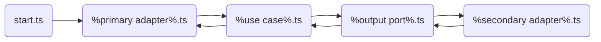

# Overview
This folder hosts the background script. It is coded in hexagonal architecture.

# Folder structure
```
.
├── 01-use-cases                 # Hosts the script logic
├── 02-ports                     # Acts as an interface between the use cases and the adapters
├── 03-adapters                  # Adapters for input (primary adapters) and output (secondary adapters)
└── ...
```
The flow is :

