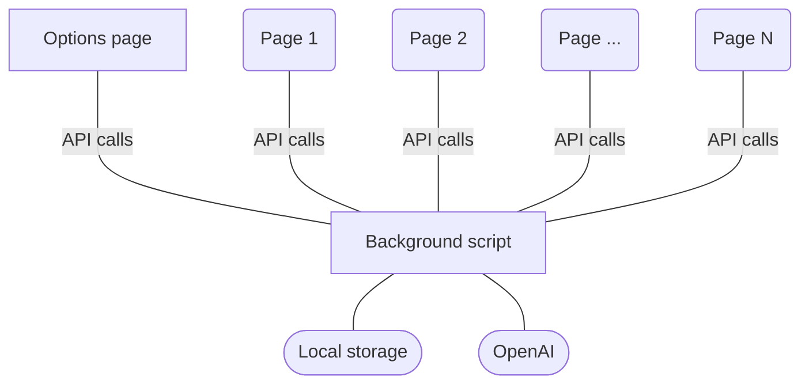

# Overview
GPT Anywhere is a browser extension (Chrome for now), that allows the user to input GPT completions anywhere on a website.

Typical use cases are:
- Social media
- Email
- User support
- Etc

# Folder structure
```
.
├── 01-shared                    # Shared types and config files
├── 02-options                   # Chrome extension's global files (manifest.json, icons, etc.)
├── 03-options                   # Options script
├── 04-background                # Background script
├── 05-content                   # Content script
└── ...
```
For reference on `options`, `background` and `content`, see [Chrome Extension](https://developer.chrome.com/docs/extensions/) documentation.

# Build
To build the Chrome extension:
1. Run `npm run build`
2. Load the extension from `./dist` folder

# Architecture
The extension saves the user's api key and prompts in the browser synced storage.

The background script exposes an API called by the Options page and every browsed page.
Scripts are communicating through this API with `runtime.sendMessage()` and `runtime.connect()`.

# License
[Unlicense](LICENSE)
